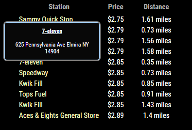

# MMM-Gas

**THIS MODULE WILL ONLY WORK IN THE USA.  It was made specifically for this.**
There is a module for overseas called MMM-Fuel :)

It's located here:
https://github.com/fewieden/MMM-Fuel

## Examples

 

## Your terminal installation instructions

* `git clone https://github.com/cowboysdude/MMM-Gas` into the `~/MagicMirror/modules` directory.`

**Go to MagicMirror/modules/MMM-Gas and run NPM INSTALL**

## Config.js entry and options
       {
        module: 'MMM-Gas',
        position: 'top_left',
        config: { 
		zip : "14904",
		typeGas: "mid-grade", //can be "mid-grade", "premium", or "diesel".  Leave blank for regular gas prices
		sortBy: "price",	//can be "distance" or "price"		
	        distance: false  //to hide distance column
	     }
       },

**NO api key needed, just your zipcode!!**

Here's a link to a video to show the address via mouseover effect

 

